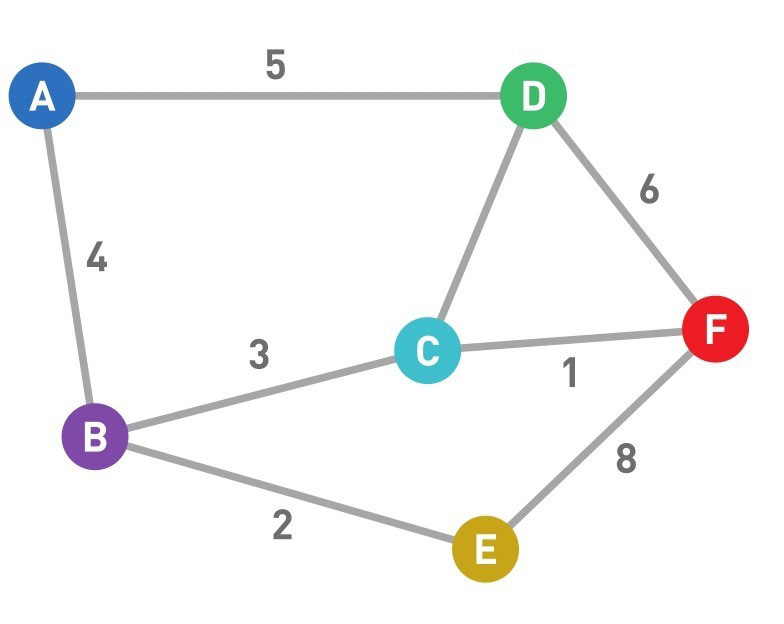
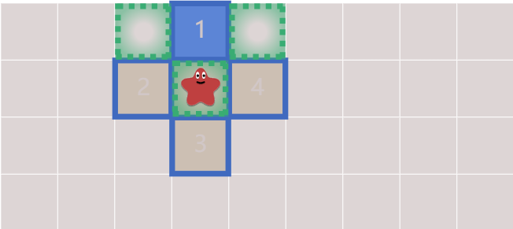

# 如何用javascript实现寻路算法
最近参加winter老师的前端训练营，上周的作业是实现一个最优的寻路算法，非科班出生的我，对于寻路算法的概念及实现都不甚了解，虽然勉强实现了基本寻路效果，但是对于如何优化毫无想法。痛定思痛，从最基础开始学习，彻底理解寻路算法！

## 概念介绍

### 队列

队列就像我们日常生活中排队一样，所有的操作必须等到队伍的第一个人完成之后，才能轮到下一个人，而新来的人只能排在队尾。

对于队列来说，添加数据的操作称之为入队，删除数据的操作称之为出队，入队跟出队只能在队列的两端操作。

我们用JavasScript中的数组来实现一下队列。

```javascript
// 首先定义一个队列
const queue = new Array();
// 数组的push() 配合 shift() ,实现尾部添加，头部删除
queue.push('a'); // 入队
queue.shift(); // 出队
// or
// 数组的 unshift() 配合 pop()，实现头部增加，尾部删除
queue.unshift('a'); // 入队
queue.pop(); // 出队
```

**不论使用什么实现队列数据结构，不能直接操作中间的数据，那样就不叫队列了。必须等到数据在首位后才能操作。**

> 队列先进去的先出来，称之为First In First Out（先进先出），简称为 FIFO；
>
> 我们广度优先搜索算法中会使用到队列进行顶点管理

### 图

通常意义上我们所接触到的图都是图表，或者图片，而在计算机科学中的图长下面这样：

<center>   
	 
    <br>
    <span style="color:orange; border-bottom: 1px solid #d9d9d9;color: #999;padding: 2px;">图片来源：我的第一本算法书</span>
</center>


上图中的圆称之为顶点，连接顶点的称之为边，而顶点和边组合起来构成的图形就是图。

每一条边上的值称之为权重，权重可以理解为，两个顶点间的距离，比如从B点到C点需要3个标准单位，从B点到A点需要4个标准单位。

而图还有有向图和无向图之分，上图表示的是无向图，因为我们可以从A到B，也可以从B到A，是没有一个固定的方向的，反之，如果在A到B的边加上了箭头，则表示只能从A到B或者从B到A。

如果我们想从A到F，那么那条路径最短呢？怎么找到这个最短的路径呢？

假设有一个图，图上有顶点s和t，我们如何找到从s到t权重之和最小的路径？ 

以上问题都是图的基本问题 -- 最短路径问题，解决这个问题的算法称之为寻路算法。

## 广度优先算法

> 盲目搜索，全部顶点标记

广度优先算法（BFS）是一种对图进行搜索的算法，也是最简单的寻路算法， 它的特点是从起点开始，由近及远的搜索全图，直到找到目标或遍历完全图为止。

它的搜索流程如下：

* 以顶点为起点，访问其相邻结点
* 选择任意的领结点继续访问该点的领结点
* 重复以上步骤直到找到目标点或遍历完全图

<center>   
	 
    <br>
    <span style="color:orange; border-bottom: 1px solid #d9d9d9;color: #999;padding: 2px;">图片来源：Introduction to the A* Algorithm</span>
</center>

> 蓝色边框代表可访问领结点，蓝色背景代表当前选中的领结点，绿色代表领结点的领结点

把上面的流程翻译成程序执行顺序，如下：

* 创建一个队列queue，用来存储将要去查看的顶点。
* 将顶点入队列，作为起始点
* 判断队列queue是否有值，有值则执行以下操作
  * 从队列中取出顶点p，由于队列先进先出原理，我们取到的点是先入队的点。
  * 将p顶点周围未被访问过的顶点入队列
  * 将入队顶点标注为visited
* 循环上述操作，直到queue中没有元素，或找到目标元素。

用JavaScript来实现一下：

```javascript
const row = 5;
const col = 7;
// 使用一维数组模拟
const map = [
  0, 0, 0, 0, 0, 0, 0,
  0, 0, 0, 1, 0, 0, 0,
  0, 0, 0, 1, 0, 0, 0,
  0, 0, 0, 1, 0, 0, 0,
  0, 0, 0, 0, 0, 0, 0,
];
function find(start, end) {
  const queue = [start]; // 创建队列
  while (queue.length) { // 判断队列长度
    const point = queue.shift();
    if (point[0] === end[0] && point[1] === end[1]) { // 判断是否找到目标点
      break;
    }
    inset(queue, [point[0] - 1, point[1]]); // 搜索相邻结点
    inset(queue, [point[0] + 1, point[1]]);	// 搜索相邻结点
    inset(queue, [point[0], point[1] - 1]);	// 搜索相邻结点
    inset(queue, [point[0], point[1] + 1]);	// 搜索相邻结点
  }
}

function inset(queue, point) {
  const index = point[0] * col + point[1];
  if (point[0] < 0 || point[1] < 0 || index < 0 || index > 35) {
    return; // 判断边界
  }
  if (map[index]) { // 判断是否有值，有值则代表已经访问过
    return;
  }
  map[index] = 2; // 更新顶点状态
  queue.push(point); // 入队操作
}
```

广度优先算法可以访问地方上的所有内容，可以判断从某一点能否到达另一点，但是没有构造出具体路径，所以我们需要修改一下入队操作，记录每个顶点的来源，这样就可以找到我们具体的路径。

## Dijkstra 算法

> 盲目搜索，最短路径
* Dijkstra 算法基于宽度优先算法进行改进，把当前看起来最短的边加入最短路径树中 ，利用贪心算法计算并最终能够产生最优结果的算法
* https://blog.csdn.net/sinat_36521655/article/details/82085936

## 贪婪最佳优先算法
> 有效搜索，路径不是最优
* https://www.ituring.com.cn/article/497664

## A*算法
> 路径最短，效率最优
* https://www.cnblogs.com/technology/archive/2011/05/26/2058842.html

## B*算法
> 效率比A*更快
* https://blog.csdn.net/qq_43461641/article/details/100711157

## 参考文章
* [Introduction to the A* Algorithm](https://www.redblobgames.com/pathfinding/a-star/introduction.html) 
* [A* Pathfinding for Beginners](https://www.gamedev.net/tutorials/_/technical/artificial-intelligence/a-pathfinding-for-beginners-r2003/)

* 《我的第一本算法书》